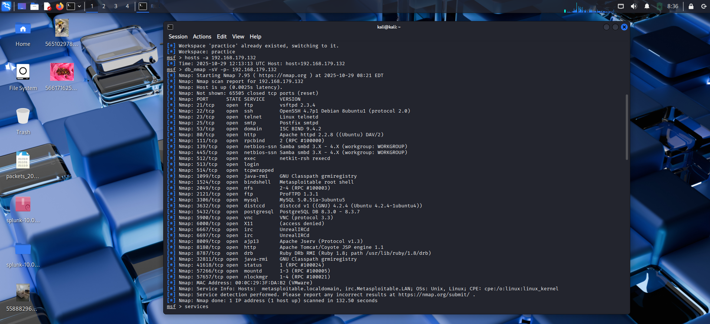

# Metasploit Lab 1 – Recon & Exploitation

## 1. Database Connected

## 2. Service Enumeration

## 3. Choosing the exploit

## 4. Root Shell via VSFTPD Backdoor

---

*All screenshots are in the `screenshots/` folder.*